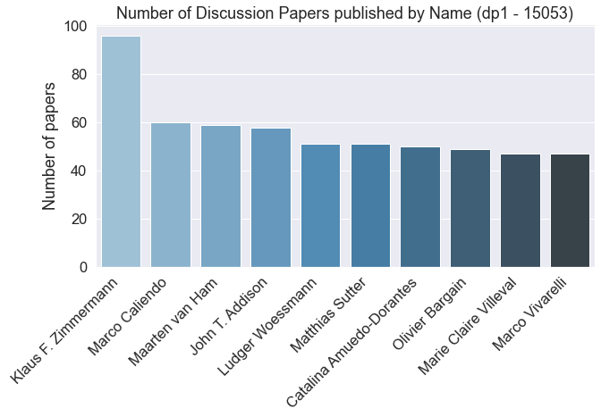

# IZA Discussion Paper Analysis
The idea of this project is to scrape the discussion paper series of the [Institute of Labor Economics (IZA)](https://www.iza.org/publications/dp), extract the meta information from the .pdf files and conduct a co-author network analysis.

## Usage
This project consists of ***two parts:***
<ol>
  <li>Script for scraping all discussion papers (requires about 10GB of free space): </li>
    <ul>
    <li>Run Part1_IZA_dp_scrape OR:</li>
    <li>Use paperlist.xlsx that contains all information up to February 2022</li>
   </ul>
  <li> Program for descriptive and network analyis (Part2_IZA_dp_network_analysis)
</ol>

:point_right: Use Binder button below to work with the Jupyter files (might take some time to load)

## TOP10 Authors by published discussion papers (from start of series to dp No. 15053)

## Acknowledgement
Code for network analysis draws from this [Kaggle competition](https://www.kaggle.com/aiswaryaramachandran/coauthor-network-analysis-using-graph-embeddings/notebook).
